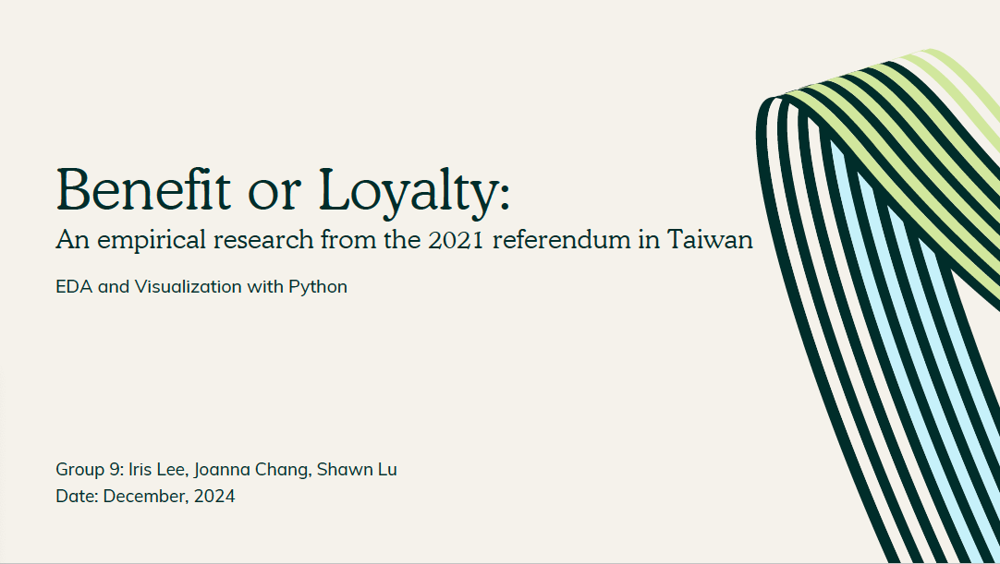

# Benefit or Loyalty: An Empirical Research from the 2021 Referendum in Taiwan
## FALL2024: EDA & Visualization_Group Project

### Introduction

Political polarization undermines democratic principles of tolerance and understanding. Research shows that political parties significantly shape citizens' policy attitudes. In Taiwan, one of the most polarized democracies, national identity, rather than left-right ideology, drives this division. Consequently, party positions on economic or trade policies may not align with their ideologies, leading citizens to support policies that contradict their own economic interests.

### Research Question

This raises the question: In a polarized political environment, do citizens prioritize personal benefit or party loyalty in their decision-making?

### Objectives

- Analyze the extent of political polarization in Taiwan
- Examine the influence of national identity on policy positions
- Investigate whether citizens prioritize personal benefit or party loyalty

### Methodology

- Conduct Exploratory Data Analysis (EDA) on data from the 2021 referendum in Taiwan
- Visualize the relationship between party positions, national identity, and citizens' policy support

## Project Slides

  <a href="./Slide_Benefit%20or%20Loyalty_An%20Empirical%20Research%20from%20the%202021%20Referendum%20in%20Taiwan.pdf">
    
     
    🖱️ Click to see the slidedeck.
  </a>

### Conclusion

- Economic benefit plays a limited role in individuals policy attitudes
- Constituents’ loyalty to their parties is the main factor drive opinion policies

### References

- Relevant research studies and data sources used in the analysis
